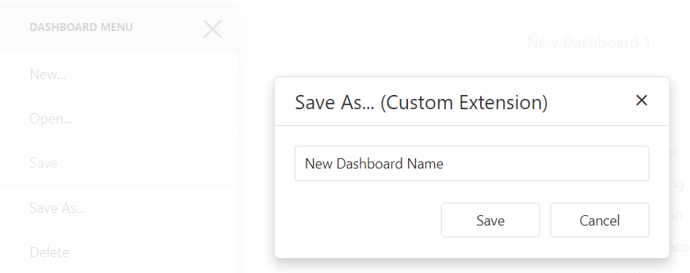

<!-- default badges list -->

<!-- default badges end -->
*Files to look at*:
- [Startup.cs](Startup.cs)
- [CustomDashboardFileStorage.cs](CustomDashboardFileStorage.cs)
- [UserDashboardController.cs](Controllers/UserDashboardController.cs)
- [extensions](ClientApp/src/app/home/extensions)
- [input-popup.component.html](ClientApp/src/app/home/input-popup.component.html)
- [delete-dashboard.service.ts](ClientApp/src/app/delete-dashboard.service.ts)
- [home.component.ts](ClientApp/src/app/home/home.component.ts)

# Dashoboard for Angular - How to implement Save As and Delete functionality by creating custom extensions

This example demonstrates how to add the "Save As" and "Delete" [menu items](https://docs.devexpress.com/Dashboard/117444) to the Web Dashboard's UI by implementing the corresponding [custom extensions](https://docs.devexpress.com/Dashboard/117543):

* The "Save As" menu item allows end-users to save the current dashboard with a new name.
* The "Delete" menu item deletes the opened dashboard from the [dashboard storage](https://docs.devexpress.com/Dashboard/116299).

The image below shows the result of the extensions implementation.

## Documentation

- [Extensions Overview](https://docs.devexpress.com/Dashboard/117543/web-dashboard/ui-elements-and-customization/extensions-overview)

## More Examples

- [Dashboard for Web Forms - How to implement the Save As and Delete functionality by creating custom extensions](https://github.com/DevExpress-Examples/web-dashboard-how-to-implement-save-as-and-delete-by-creating-custom-extensions-t466761)
- [Dashboard for MVC - How to implement the Save As and Delete functionality by creating custom extensions](https://github.com/DevExpress-Examples/mvc-dashboard-how-to-define-extensions-providing-the-save-as-and-delete-functionality-t504201)
- [Dashboard for ASP.NET Core - How to implement the Save As and Delete functionality by creating custom extensions](https://github.com/DevExpress-Examples/aspnet-core-dashboard-how-to-implement-the-save-as-and-delete-functionality-by-creating-cu-t601084)
